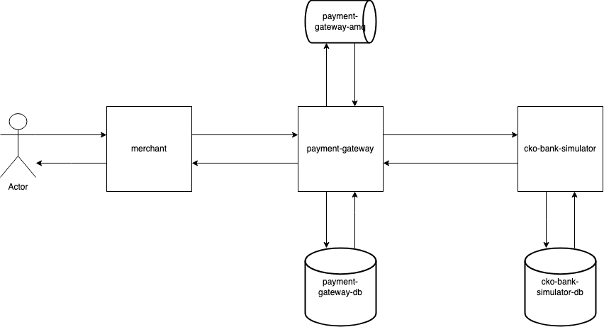

# Checkout.com Solution




## How to run
1. install and run mysql with password: Checkout.comTest
* brew install mysql
* mysql -u root -p


2. install and run acitve mq
 * brew install apache-activemq
 * brew services start activemq

3. run cko-bank-simulator
4. run payments-gateway


## cko-bank-simulator
The cko-bank-simulator follows the one-time payment documentation of Worldpay API
>https://developer.worldpay.com/docs/access-worldpay/payments/authorize-a-payment

Create authorisation -> Settle Transaction -> Refund Transaction
Create authorisation -> Cancel Authorisation

## payment-gateway
Use */payment*" endpoint to create an authorisation
Once the *authorisation* is completed is automatically creates a Settle Transaction

## Documentation
# Project: checkout-com-postman
# 📁 Collection: payment-gateway


## End-point: Retrieve transactions
### Method: GET
>```
>http://localhost:8080/events/{transactionReference}
>```

⁃ ⁃ ⁃ ⁃ ⁃ ⁃ ⁃ ⁃ ⁃ ⁃ ⁃ ⁃ ⁃ ⁃ ⁃ ⁃ ⁃ ⁃ ⁃ ⁃ ⁃ ⁃ ⁃ ⁃ ⁃ ⁃ ⁃ ⁃ ⁃ ⁃ ⁃ ⁃ ⁃ ⁃ ⁃ ⁃ ⁃ ⁃ ⁃ ⁃ ⁃ ⁃ ⁃ ⁃ ⁃ ⁃ ⁃

## End-point: Make payment
### Method: POST
>```
>http://localhost:8080/payment
>```
### Body (**raw**)

```json
{
    "merchant": {
        "merchantName": "Tudor's shop"
    },
    "basket": {
        "items": [
            {
                "name": "Item 1",
                "description": "Item description 1",
                "quantity": 1,
                "price": 12.0
            },
            {
                "name": "Item 2",
                "description": "Item description 2",
                "quantity": 1,
                "price": 12.0
            }
        ],
        "amount": 24.0
    },
    "cardDetails": {
        "cardNumber": "1111222233334444",
        "cardExpiryDate": {
            "month": 11,
            "year": 2024
        },
        "cvv": "123"
    },
    "paymentMethod": "card",
    "currency": "GBP",
    "totalAmount": 24.0
}
```


⁃ ⁃ ⁃ ⁃ ⁃ ⁃ ⁃ ⁃ ⁃ ⁃ ⁃ ⁃ ⁃ ⁃ ⁃ ⁃ ⁃ ⁃ ⁃ ⁃ ⁃ ⁃ ⁃ ⁃ ⁃ ⁃ ⁃ ⁃ ⁃ ⁃ ⁃ ⁃ ⁃ ⁃ ⁃ ⁃ ⁃ ⁃ ⁃ ⁃ ⁃ ⁃ ⁃ ⁃ ⁃ ⁃ ⁃
# 📁 Collection: cko-bank-simulator


## End-point: Retrieve events
### Method: GET
>```
>http://localhost:8090/payments/transaction/events/{correlationId}
>```

⁃ ⁃ ⁃ ⁃ ⁃ ⁃ ⁃ ⁃ ⁃ ⁃ ⁃ ⁃ ⁃ ⁃ ⁃ ⁃ ⁃ ⁃ ⁃ ⁃ ⁃ ⁃ ⁃ ⁃ ⁃ ⁃ ⁃ ⁃ ⁃ ⁃ ⁃ ⁃ ⁃ ⁃ ⁃ ⁃ ⁃ ⁃ ⁃ ⁃ ⁃ ⁃ ⁃ ⁃ ⁃ ⁃ ⁃

## End-point: Create authorisation
### Method: POST
>```
>http://localhost:8090/payments/authorisation
>```
### Body (**raw**)

```json
{
    "transactionReference": "PGW-tudorsshop-61",
    "merchant": {
        "entity": "Tudor's Shop"
    },
    "instruction": {
        "narrative": {
            "line1": "Mind Palace"
        },
        "value": {
            "currency": "GBP",
            "amount": 0
        },
        "paymentInstrument": {
            "type": "card/plain",
            "cardNumber": "1111222233334444",
            "cardExpiryDate": {
                "month": 5,
                "year": 2035
            }
        }
    }
}
```

⁃ ⁃ ⁃ ⁃ ⁃ ⁃ ⁃ ⁃ ⁃ ⁃ ⁃ ⁃ ⁃ ⁃ ⁃ ⁃ ⁃ ⁃ ⁃ ⁃ ⁃ ⁃ ⁃ ⁃ ⁃ ⁃ ⁃ ⁃ ⁃ ⁃ ⁃ ⁃ ⁃ ⁃ ⁃ ⁃ ⁃ ⁃ ⁃ ⁃ ⁃ ⁃ ⁃ ⁃ ⁃ ⁃ ⁃

## End-point: Settle transaction
### Method: POST
>```
>http://localhost:8090/payments/transaction/settle/{correlationId}
>```

⁃ ⁃ ⁃ ⁃ ⁃ ⁃ ⁃ ⁃ ⁃ ⁃ ⁃ ⁃ ⁃ ⁃ ⁃ ⁃ ⁃ ⁃ ⁃ ⁃ ⁃ ⁃ ⁃ ⁃ ⁃ ⁃ ⁃ ⁃ ⁃ ⁃ ⁃ ⁃ ⁃ ⁃ ⁃ ⁃ ⁃ ⁃ ⁃ ⁃ ⁃ ⁃ ⁃ ⁃ ⁃ ⁃ ⁃

## End-point: Refund Transaction
### Method: POST
>```
>http://localhost:8090/payments/transaction/refund/{correlationId}
>```

⁃ ⁃ ⁃ ⁃ ⁃ ⁃ ⁃ ⁃ ⁃ ⁃ ⁃ ⁃ ⁃ ⁃ ⁃ ⁃ ⁃ ⁃ ⁃ ⁃ ⁃ ⁃ ⁃ ⁃ ⁃ ⁃ ⁃ ⁃ ⁃ ⁃ ⁃ ⁃ ⁃ ⁃ ⁃ ⁃ ⁃ ⁃ ⁃ ⁃ ⁃ ⁃ ⁃ ⁃ ⁃ ⁃ ⁃

## End-point: Cancel Authorisation
### Method: POST
>```
>http://localhost:8090/payments/transaction/cancel/{correlationId}
>```

⁃ ⁃ ⁃ ⁃ ⁃ ⁃ ⁃ ⁃ ⁃ ⁃ ⁃ ⁃ ⁃ ⁃ ⁃ ⁃ ⁃ ⁃ ⁃ ⁃ ⁃ ⁃ ⁃ ⁃ ⁃ ⁃ ⁃ ⁃ ⁃ ⁃ ⁃ ⁃ ⁃ ⁃ ⁃ ⁃ ⁃ ⁃ ⁃ ⁃ ⁃ ⁃ ⁃ ⁃ ⁃ ⁃ ⁃
_________________________________________________