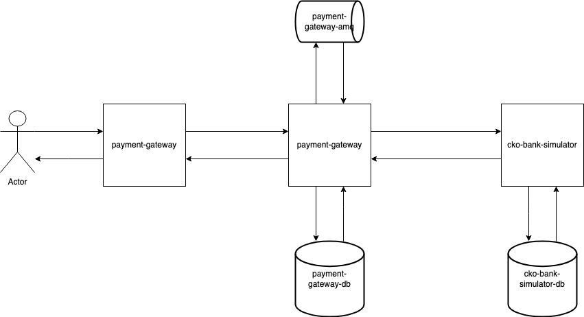

# Checkout.com Solution

## How to run
1. install and run mysql with password: Checkout.comTest
* 
* mysql -u root -p

2. install and run acitve mq
 * brew install apache-activemq
 * brew services start activemq

3. run cko-bank-simulator
4. run payments-gateway